# School-Mito
en este ejemplo se crea un crud con Genericos(repositorios, services, controllers) tambien el uso de routing y handlers pra mongo reactivo validator en webflux y seguridad  
## Mono de Ejecucion
   ```bash
- mvn clean verify
   ```

# School-Mito

Tenemos un ejemplo de cruds con clases genericas tanto para el repository service y controller
tambien el uso de reactividad con Mongo reactive Webflux JAVA 17 Validadores y seguridad

## Requisitos Previos

- JDK 17 o superior
- MongoDB instalado y configurado

## Configuración de la Base de Datos

1. **Crear la base de datos en MongoDB:** - **SCHOOL**
2. Json: **Tips Al final de todo xD**
```json
{
  "_id" : ObjectId("667707a21217d4584f4983a7"),
  "name" : "ADMINISTRADOR"
},
{
  "_id" : ObjectId("667707ab1217d4584f4983a8"),
  "name" : "USUARIO"
}
```

3. Registar dos roles **ADMINISTADOR Y USUARIO**


# Se deja Documento Postman en la raiz ./postman

## Registrar una Persona siempre como USUARIO
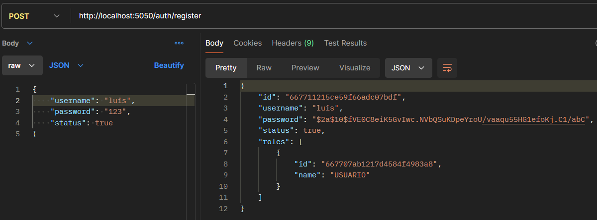

## Authenticarse con el User Creado
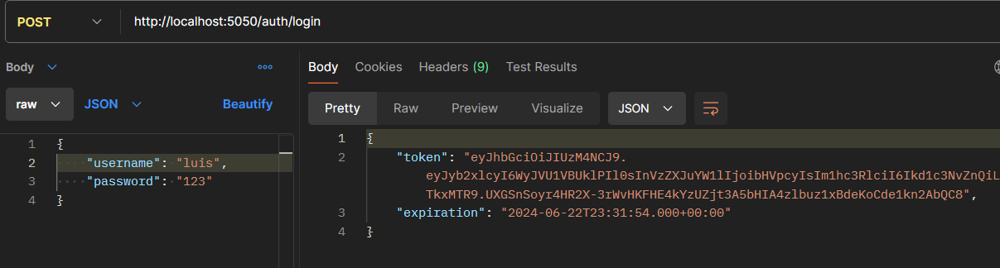

## En caso no se Logeado con su Usuario Correctamente
### para este caso al no tener un token activo este devolvera un Error 401 Unauthorized
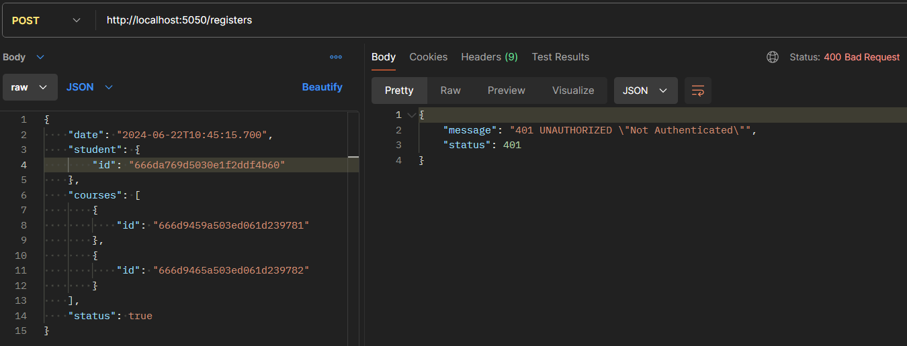

## Enviar Peticion con el Token para Registar una Matricula
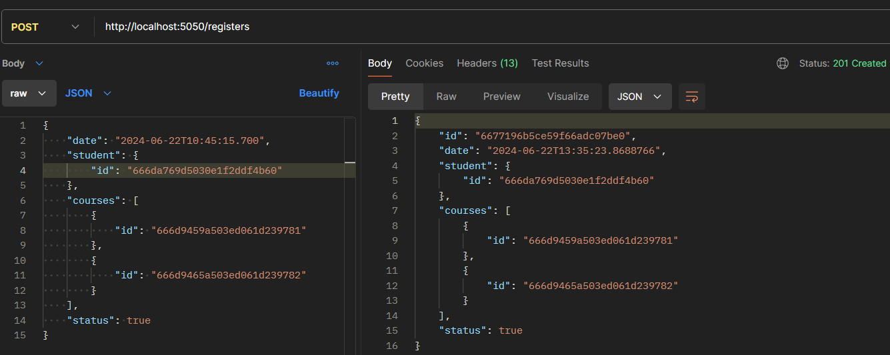
### Token agregado como Cabecera o en Auth el tipo seria Bearer Token.
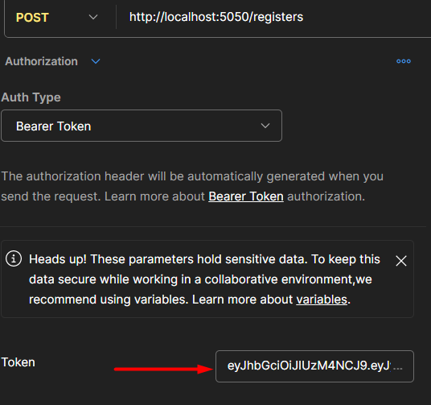

## Consultar Esa Matricula por el Id:
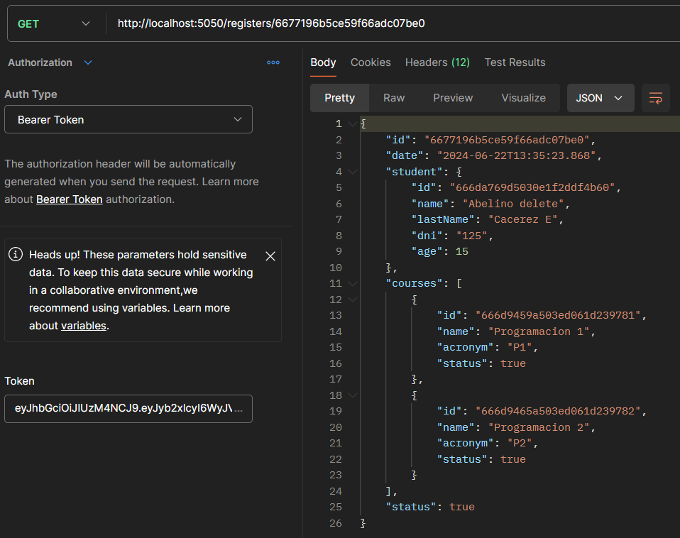

## Consultar Todos los Estudiantes v2 Controller Generico sin filtros

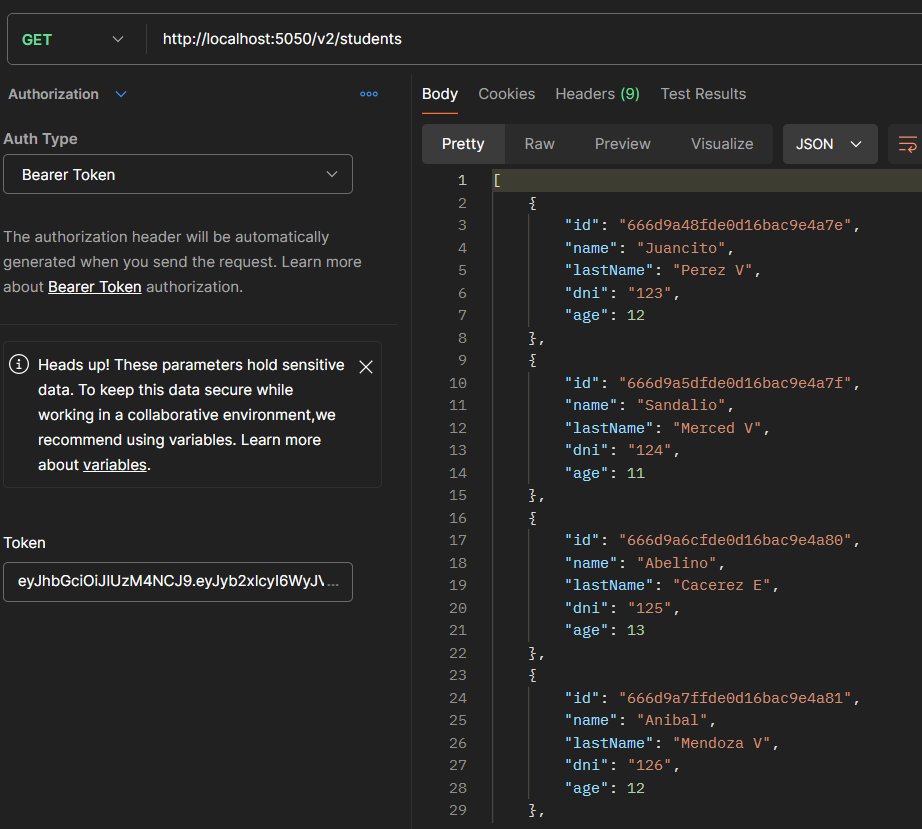

## Consultar todos los Estudiantes con un OrderBY Asc o Desc

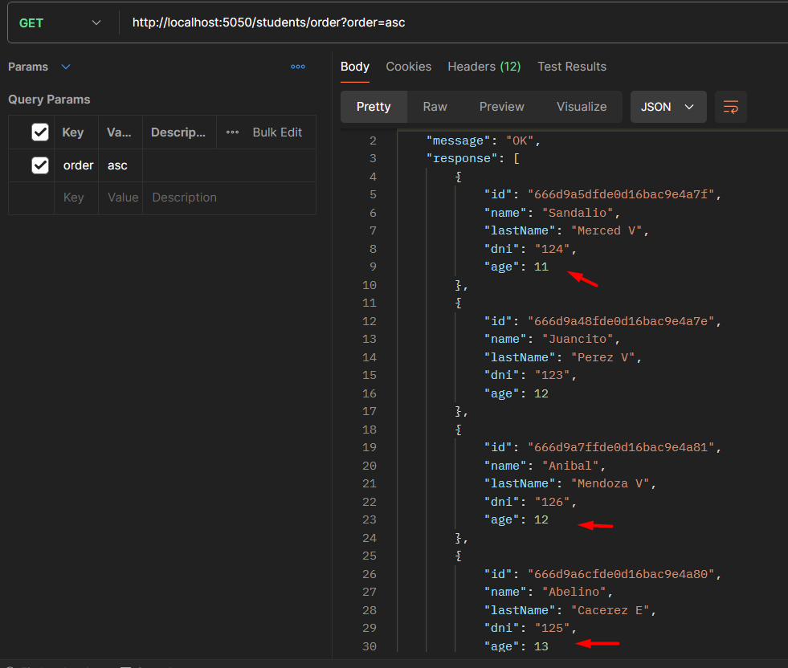

## Consultar Estudiantes de forma Paginada 
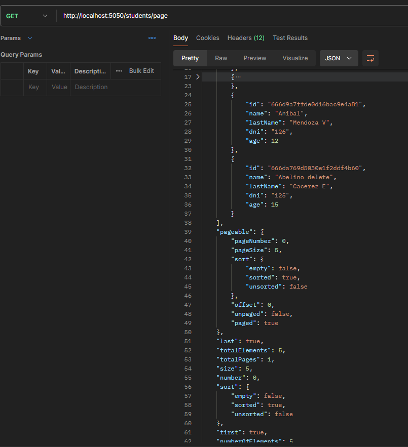

## Consultar Listado de Courses con el Handler y Routing Reactivo
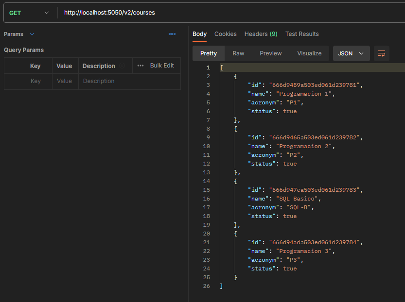

### Siempre puedes Activar el registar Roles y hacerlo desde postman :)
### Luego eliminas el "/roles" y continuas
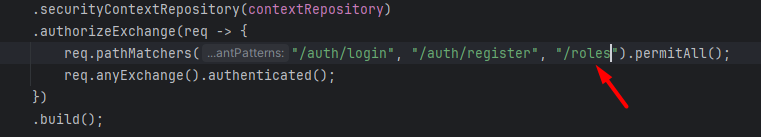